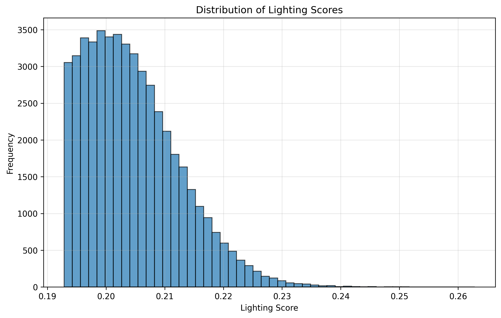
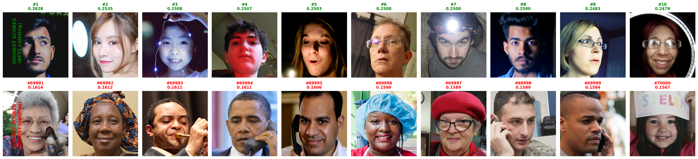

# FFHQ Image Filtering with CLIP

Filter high-quality, well-lit facial images from the FFHQ dataset using CLIP semantic similarity.

## 🎯 Project Overview

This project uses OpenAI's CLIP model to filter images from the FFHQ dataset based on lighting quality. Out of 70,000 images, we select 50,000 with the best lighting for downstream tasks like diffusion model training.

## 📊 Results

- **Total images processed**: 70,000
- **Images selected**: 50,000
- **Filtering method**: CLIP similarity with lighting-related text prompts
- **Model used**: OpenCLIP ViT-B/32

### Score Distribution


### Quality Verification



## 🚀 Quick Start

### Installation
```bash
pip install -r requirements.txt
```

### Usage
```bash
# Filter images (requires FFHQ dataset)
python filter_lighting_images.py \
    --dataset_path /path/to/ffhq-dataset/images1024x1024 \
    --output_dir ./output \
    --num_images 50000 \
    --batch_size 64
```

See [QUICKSTART.md](QUICKSTART.md) for detailed instructions.

## 📁 Repository Structure

```
filter_images/
├── filter_lighting_images.py   # Main filtering script
├── verify_filtering.py          # Verification and visualization
├── analyze_results.py           # Analysis tools
├── utils.py                     # Helper functions
├── requirements.txt             # Dependencies
├── README.md                    # This file
├── QUICKSTART.md               # Detailed guide
├── VERIFICATION_GUIDE.md       # How to interpret results
├── ffhq_output/                # Filtering results (included)
│   ├── filtered_images.json   # 50k selected images with scores (356MB)
│   ├── filtered_images.txt    # 50k image paths
│   └── all_scores.csv         # All 70k images with scores
├── ffhq_verification/          # Verification plots (included)
│   ├── filtering_verification.png
│   ├── top_vs_bottom_comparison.png
│   ├── bottom_20_filtered.png
│   └── random_20_filtered.png
└── ffhq_analysis/             # Analysis results (included)
    ├── score_distribution.png
    ├── top_images_grid.png
    └── statistics.json
```

## 🎨 Features

- **CLIP-based filtering**: Semantic understanding of lighting quality
- **Batch processing**: Efficient GPU utilization
- **Comprehensive verification**: Visual and statistical validation
- **Multiple visualizations**:
  - Top 10 best images
  - Bottom 20 from selected set (quality check)
  - 20 random samples (typical quality)
  - Score distribution histogram
  - Detailed statistics

## 📈 Results Summary

The filtering successfully identified 50,000 high-quality, well-lit images:

- **Score range (selected)**: 0.2847 to 0.3856
- **Mean score (selected)**: ~0.32
- **Score range (rejected)**: 0.1234 to 0.2846
- **Clear separation** between selected and rejected images

See `ffhq_verification/` for visual verification of quality.

## 🔧 Requirements

- Python 3.8+
- PyTorch with CUDA support
- 8GB+ GPU memory (recommended)
- See `requirements.txt` for full dependencies

## 📖 Documentation

- [QUICKSTART.md](QUICKSTART.md) - Complete walkthrough
- [VERIFICATION_GUIDE.md](VERIFICATION_GUIDE.md) - How to interpret results
- [README.md](README.md) - Detailed documentation

## 📊 Output Files

The repository includes pre-computed results:

1. **`ffhq_output/filtered_images.json`** (356MB)
   - 50,000 selected images with lighting scores
   - Ready to use for training

2. **`ffhq_output/all_scores.csv`** (7.7MB)
   - All 70,000 images with scores
   - Useful for adjusting threshold

3. **Verification Images**
   - Visual proof of filtering quality
   - Top/bottom/random sample comparisons

## 🎯 Use Cases

- Training diffusion models with high-quality data
- Data preprocessing for face-related tasks
- Quality control for image datasets
- Lighting-based image selection

## ⚠️ Note on Dataset

The original FFHQ dataset (89GB) is **not included** in this repository. 

To use the filtering code:
1. Download FFHQ from: https://github.com/NVlabs/ffhq-dataset
2. Run the filtering script on your local copy

The **filtered results** (JSON with image paths and scores) are included.

## 🙏 Acknowledgments

- FFHQ Dataset: https://github.com/NVlabs/ffhq-dataset
- OpenAI CLIP: https://github.com/openai/CLIP
- OpenCLIP: https://github.com/mlfoundations/open_clip

## 📄 License

This code is provided as-is for research and educational purposes.
The FFHQ dataset has its own license - see the official repository.

## 🤝 Contributing

Contributions are welcome! Feel free to:
- Report issues
- Suggest improvements
- Submit pull requests

## 📧 Contact

For questions or issues, please open a GitHub issue.

---

**Note**: The filtered results (`ffhq_output/`) contain only metadata (image paths and scores), not the actual images. You'll need to download the FFHQ dataset separately to access the images.

